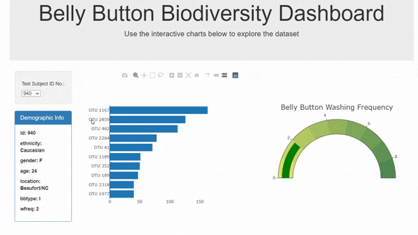

# Visualizing Bellybutton Biodiversity using Plotly

This is a simple interactive webpage that displays information about biodiversity found in the bellybutton of each test subject.

Currently the webpage is not hosted, so the easiest way to view is to clone the repo and open index.html using the Live Server plugin for Visual Studio Code. 

### Preview

